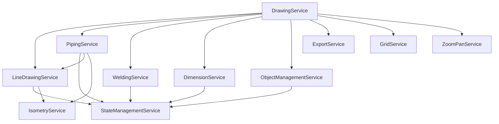

# 🏗️ Technische Architektur & Backend-Integration

## 📚 Inhaltsverzeichnis

1. [Architektur-Übersicht](#architektur-übersicht)
2. [Service-Architektur im Detail](#service-architektur-im-detail)
3. [Datenfluss und Kommunikation](#datenfluss-und-kommunikation)
4. [Backend-Integration](#backend-integration)
5. [API-Design](#api-design)
6. [Deployment-Strategien](#deployment-strategien)
7. [Skalierung und Performance](#skalierung-und-performance)

---

## 🎯 Architektur-Übersicht

### Technologie-Stack

```
┌─────────────────────────────────────────┐
│           Frontend (Client)              │
├─────────────────────────────────────────┤
│  Angular 20 (Standalone Components)     │
│  TypeScript 5.8                         │
│  Fabric.js 6.7.1 (Canvas Engine)        │
│  RxJS 7.8 (Reactive Programming)        │
└─────────────────────────────────────────┘
                    │
                    ▼
┌─────────────────────────────────────────┐
│         Potentielles Backend             │
├─────────────────────────────────────────┤
│  REST API / GraphQL / WebSocket         │
│  Node.js / .NET Core / Java Spring      │
│  PostgreSQL / MongoDB                    │
│  Redis (Cache & Session)                │
└─────────────────────────────────────────┘
```

### Projekt-Struktur

```
isometrien/
├── src/
│   ├── app/
│   │   ├── components/          # UI-Komponenten
│   │   │   ├── canvas/          # Haupt-Canvas-Komponente
│   │   │   └── toolbar/         # Werkzeugleisten-UI
│   │   ├── services/            # Business Logic
│   │   │   ├── drawing.service.ts        # Zentrale Orchestrierung
│   │   │   ├── line-drawing.service.ts   # Linien/Rohr-Zeichnung
│   │   │   ├── piping.service.ts         # Rohrleitungssysteme
│   │   │   ├── welding.service.ts        # Schweißsymbole
│   │   │   ├── dimension.service.ts      # Bemaßungssystem
│   │   │   ├── state-management.service.ts # Undo/Redo
│   │   │   └── ...                       # Weitere Services
│   │   └── models/              # TypeScript Interfaces
│   └── assets/                  # Statische Ressourcen
├── dist/                        # Build-Output
└── package.json                 # Dependencies
```

---

## 🔧 Service-Architektur im Detail

### 1. DrawingService (Zentrale Orchestrierung)

```typescript
// Hauptverantwortlichkeiten:
class DrawingService {
  // Mode Management
  private drawingMode: DrawingMode = 'idle';

  // Canvas-Referenz
  private canvas: fabric.Canvas;

  // Service-Verbindungen
  constructor(
    private lineDrawingService: LineDrawingService,
    private pipingService: PipingService,
    private weldingService: WeldingService,
    private dimensionService: DimensionService,
    private stateManagementService: StateManagementService
  ) {
    // Service-Verkettung initialisieren
    this.connectServices();
  }

  // Event-Routing basierend auf Mode
  handleMouseDown(event: MouseEvent) {
    switch(this.drawingMode) {
      case 'addLine':
        this.lineDrawingService.handleMouseDown(event);
        break;
      case 'weldstamp':
        this.weldingService.handleWeldStamp(event);
        break;
      // ... weitere Modi
    }
  }
}
```

**Kommunikationsmuster:**
- **Hub-and-Spoke**: DrawingService als zentraler Hub
- **Event-Delegation**: Mouse/Keyboard Events werden geroutet
- **Mode-based Routing**: Aktiver Modus bestimmt Service-Aktivierung

### 2. StateManagementService (Undo/Redo System)

```typescript
class StateManagementService {
  private history: CanvasState[] = [];
  private currentIndex = -1;
  private maxHistorySize = 50;

  // Wrapper für alle modifizierenden Operationen
  executeOperation(description: string, operation: () => void) {
    // Vor-Operation: Speichere aktuellen Zustand
    const stateBefore = this.serializeCanvas();

    // Führe Operation aus
    operation();

    // Nach-Operation: Speichere neuen Zustand
    this.saveState(description);
  }

  // Canvas-Serialisierung mit Custom Properties
  private serializeCanvas(): string {
    return JSON.stringify(this.canvas.toJSON([
      'customType', 'isDimensionPart', 'dimensionId',
      'isWeldPoint', 'data', 'reusable', 'originalFill',
      'associatedLines', 'isAnchor', 'lineId', 'anchorIndex',
      'pipeId'
    ]));
  }
}
```

**State-Management-Pattern:**
- **Command Pattern**: Jede Operation wird gekapselt
- **Memento Pattern**: Canvas-Zustände werden gespeichert
- **Limited History**: Maximal 50 Zustände im Speicher

### 3. Service-Dependency-Graph



### 4. Fabric.js Integration

```typescript
// Custom Fabric Objects
interface CustomFabricObject extends fabric.Object {
  // Erweiterte Properties für Business Logic
  customType?: string;
  isAnchor?: boolean;
  lineId?: string;
  pipeId?: string;
  dimensionId?: string;
  isWeldPoint?: boolean;
  data?: any;
}

// Event-Handler-Registrierung
canvas.on('mouse:down', (e) => drawingService.handleMouseDown(e));
canvas.on('mouse:move', (e) => drawingService.handleMouseMove(e));
canvas.on('mouse:up', (e) => drawingService.handleMouseUp(e));
```

---

## 📊 Datenfluss und Kommunikation

### Event-Flow-Diagramm

```
User Input → Canvas Events → DrawingService → Specific Service → StateManagement → Canvas Update
     ↑                                                                                    ↓
     └────────────────────────── Visual Feedback ←──────────────────────────────────────┘
```

### Service-Kommunikations-Patterns

1. **Dependency Injection**
   - Services sind Singletons (`providedIn: 'root'`)
   - Automatische Instanziierung durch Angular DI

2. **Observable Pattern (RxJS)**
   ```typescript
   // GridService Beispiel
   private gridStateSubject = new BehaviorSubject<GridState>({...});
   public gridState$ = this.gridStateSubject.asObservable();
   ```

3. **Direct Method Calls**
   ```typescript
   // Service-zu-Service Kommunikation
   this.lineDrawingService.setStateManagement(this.stateManagementService);
   ```

---

## 🔌 Backend-Integration

### Integration-Architektur

```typescript
// 1. API Service erstellen
@Injectable({ providedIn: 'root' })
export class ApiService {
  private apiUrl = environment.apiUrl;

  constructor(private http: HttpClient) {}

  // Zeichnung speichern
  saveDrawing(drawingData: any): Observable<Drawing> {
    return this.http.post<Drawing>(`${this.apiUrl}/drawings`, {
      data: drawingData,
      metadata: this.extractMetadata(drawingData)
    });
  }

  // Zeichnung laden
  loadDrawing(id: string): Observable<Drawing> {
    return this.http.get<Drawing>(`${this.apiUrl}/drawings/${id}`);
  }

  // Kollaborative Features
  subscribeToDrawing(id: string): Observable<DrawingUpdate> {
    // WebSocket-Verbindung für Echtzeit-Updates
    return this.websocketService.connect(`ws://api/drawings/${id}`);
  }
}
```

### Backend-Datenmodell

```typescript
// TypeScript Interface für API
interface Drawing {
  id: string;
  name: string;
  projectId: string;
  canvasData: string;  // Serialisierter Canvas-State
  metadata: DrawingMetadata;
  created: Date;
  modified: Date;
  createdBy: string;
  version: number;
}

interface DrawingMetadata {
  pipeCount: number;
  weldCount: number;
  dimensionCount: number;
  isometricView: string;
  scale: number;
  units: 'mm' | 'inch';
  customProperties: Record<string, any>;
}
```

### REST API Endpoints

```yaml
# Drawing Management
GET    /api/drawings              # Liste aller Zeichnungen
GET    /api/drawings/:id          # Einzelne Zeichnung
POST   /api/drawings              # Neue Zeichnung
PUT    /api/drawings/:id          # Zeichnung aktualisieren
DELETE /api/drawings/:id          # Zeichnung löschen
PATCH  /api/drawings/:id/metadata # Metadaten aktualisieren

# Collaboration
GET    /api/drawings/:id/collaborators
POST   /api/drawings/:id/share
WS     /api/drawings/:id/stream   # WebSocket für Echtzeit

# Export
GET    /api/drawings/:id/export/pdf
GET    /api/drawings/:id/export/dxf
GET    /api/drawings/:id/export/svg

# Templates & Libraries
GET    /api/templates             # Vorlagen
GET    /api/symbols               # Symbol-Bibliothek
POST   /api/symbols/custom        # Custom Symbole
```

### WebSocket Integration für Echtzeit-Kollaboration

```typescript
// WebSocket Service
@Injectable({ providedIn: 'root' })
export class CollaborationService {
  private socket: WebSocket;
  private updates$ = new Subject<CanvasUpdate>();

  connect(drawingId: string) {
    this.socket = new WebSocket(`ws://api/drawings/${drawingId}/stream`);

    this.socket.onmessage = (event) => {
      const update = JSON.parse(event.data);
      this.handleRemoteUpdate(update);
    };
  }

  // Lokale Änderungen broadcasten
  broadcastChange(change: CanvasChange) {
    this.socket.send(JSON.stringify({
      type: 'canvas_update',
      data: change,
      userId: this.authService.currentUser.id,
      timestamp: Date.now()
    }));
  }

  // Remote-Updates verarbeiten
  private handleRemoteUpdate(update: CanvasUpdate) {
    // Konfliktauflösung mit Operational Transform
    const resolved = this.conflictResolver.resolve(update);
    this.canvas.loadFromJSON(resolved);
  }
}
```

---

## 🏛️ API-Design Empfehlungen

### 1. GraphQL Alternative

```graphql
type Drawing {
  id: ID!
  name: String!
  projectId: ID!
  canvasData: String!
  metadata: DrawingMetadata!
  collaborators: [User!]!
  history: [DrawingVersion!]!
}

type Query {
  drawing(id: ID!): Drawing
  drawings(projectId: ID, filter: DrawingFilter): [Drawing!]!
}

type Mutation {
  createDrawing(input: DrawingInput!): Drawing!
  updateDrawing(id: ID!, input: DrawingInput!): Drawing!
  shareDrawing(id: ID!, userId: ID!, permission: Permission!): Drawing!
}

type Subscription {
  drawingUpdated(id: ID!): DrawingUpdate!
}
```

### 2. Datenbank-Schema (PostgreSQL)

```sql
-- Haupttabelle für Zeichnungen
CREATE TABLE drawings (
    id UUID PRIMARY KEY DEFAULT gen_random_uuid(),
    name VARCHAR(255) NOT NULL,
    project_id UUID REFERENCES projects(id),
    canvas_data JSONB NOT NULL,
    metadata JSONB,
    created_at TIMESTAMP DEFAULT CURRENT_TIMESTAMP,
    updated_at TIMESTAMP DEFAULT CURRENT_TIMESTAMP,
    created_by UUID REFERENCES users(id),
    version INTEGER DEFAULT 1
);

-- Versionierung
CREATE TABLE drawing_versions (
    id UUID PRIMARY KEY DEFAULT gen_random_uuid(),
    drawing_id UUID REFERENCES drawings(id) ON DELETE CASCADE,
    version INTEGER NOT NULL,
    canvas_data JSONB NOT NULL,
    changed_by UUID REFERENCES users(id),
    change_description TEXT,
    created_at TIMESTAMP DEFAULT CURRENT_TIMESTAMP
);

-- Kollaboration
CREATE TABLE drawing_collaborators (
    drawing_id UUID REFERENCES drawings(id) ON DELETE CASCADE,
    user_id UUID REFERENCES users(id),
    permission VARCHAR(20) CHECK (permission IN ('view', 'edit', 'admin')),
    PRIMARY KEY (drawing_id, user_id)
);

-- Indizes für Performance
CREATE INDEX idx_drawings_project ON drawings(project_id);
CREATE INDEX idx_drawings_created_by ON drawings(created_by);
CREATE INDEX idx_drawing_versions_drawing ON drawing_versions(drawing_id);
```

### 3. Authentication & Authorization

```typescript
// JWT-basierte Authentifizierung
@Injectable()
export class AuthInterceptor implements HttpInterceptor {
  intercept(req: HttpRequest<any>, next: HttpHandler) {
    const token = this.authService.getToken();

    if (token) {
      req = req.clone({
        headers: req.headers.set('Authorization', `Bearer ${token}`)
      });
    }

    return next.handle(req);
  }
}

// Permission Guard
@Injectable()
export class DrawingPermissionGuard implements CanActivate {
  canActivate(route: ActivatedRouteSnapshot): Observable<boolean> {
    const drawingId = route.params.id;
    return this.permissionService.canEdit(drawingId);
  }
}
```

---

## 🚀 Deployment-Strategien

### 1. Container-basiertes Deployment (Docker)

```dockerfile
# Frontend Dockerfile
FROM node:20-alpine AS builder
WORKDIR /app
COPY package*.json ./
RUN npm ci
COPY . .
RUN npm run build --prod

FROM nginx:alpine
COPY --from=builder /app/dist/isometrics-app /usr/share/nginx/html
COPY nginx.conf /etc/nginx/conf.d/default.conf
EXPOSE 80
```

```yaml
# docker-compose.yml
version: '3.8'

services:
  frontend:
    build: ./frontend
    ports:
      - "80:80"
    environment:
      - API_URL=http://backend:3000
    depends_on:
      - backend

  backend:
    build: ./backend
    ports:
      - "3000:3000"
    environment:
      - DATABASE_URL=postgresql://user:pass@db:5432/isometry
      - REDIS_URL=redis://redis:6379
    depends_on:
      - db
      - redis

  db:
    image: postgres:15
    environment:
      - POSTGRES_DB=isometry
      - POSTGRES_USER=user
      - POSTGRES_PASSWORD=pass
    volumes:
      - postgres_data:/var/lib/postgresql/data

  redis:
    image: redis:7-alpine
    ports:
      - "6379:6379"

volumes:
  postgres_data:
```

### 2. Kubernetes Deployment

```yaml
# frontend-deployment.yaml
apiVersion: apps/v1
kind: Deployment
metadata:
  name: isometry-frontend
spec:
  replicas: 3
  selector:
    matchLabels:
      app: isometry-frontend
  template:
    metadata:
      labels:
        app: isometry-frontend
    spec:
      containers:
      - name: frontend
        image: isometry/frontend:latest
        ports:
        - containerPort: 80
        env:
        - name: API_URL
          valueFrom:
            configMapKeyRef:
              name: app-config
              key: api.url
---
apiVersion: v1
kind: Service
metadata:
  name: isometry-frontend
spec:
  selector:
    app: isometry-frontend
  ports:
    - port: 80
      targetPort: 80
  type: LoadBalancer
```

### 3. CI/CD Pipeline (GitHub Actions)

```yaml
name: Deploy Isometry App

on:
  push:
    branches: [main]

jobs:
  build-and-deploy:
    runs-on: ubuntu-latest

    steps:
    - uses: actions/checkout@v3

    - name: Setup Node.js
      uses: actions/setup-node@v3
      with:
        node-version: '20'

    - name: Install and Build
      run: |
        npm ci
        npm run build --prod

    - name: Run Tests
      run: npm test -- --watch=false --browsers=ChromeHeadless

    - name: Build Docker Image
      run: |
        docker build -t isometry:${{ github.sha }} .
        docker tag isometry:${{ github.sha }} isometry:latest

    - name: Deploy to Kubernetes
      env:
        KUBE_CONFIG: ${{ secrets.KUBE_CONFIG }}
      run: |
        echo "$KUBE_CONFIG" | base64 -d > kubeconfig
        kubectl --kubeconfig=kubeconfig set image deployment/isometry-frontend frontend=isometry:${{ github.sha }}
```

---

## ⚡ Skalierung und Performance

### Frontend-Optimierungen

```typescript
// 1. Lazy Loading für große Zeichnungen
class CanvasOptimizer {
  private visibleObjects = new Set<fabric.Object>();

  optimizeRendering() {
    const viewport = this.canvas.getViewport();

    this.canvas.getObjects().forEach(obj => {
      const isVisible = this.isInViewport(obj, viewport);
      obj.visible = isVisible;

      if (isVisible) {
        this.visibleObjects.add(obj);
      } else {
        this.visibleObjects.delete(obj);
      }
    });
  }
}

// 2. Web Workers für schwere Berechnungen
// isometry.worker.ts
addEventListener('message', ({ data }) => {
  if (data.type === 'calculate_pipe_path') {
    const result = calculateComplexPipePath(data.points);
    postMessage({ type: 'pipe_path_result', result });
  }
});

// 3. Virtual Scrolling für große Objektlisten
@Component({
  template: `
    <cdk-virtual-scroll-viewport itemSize="50" class="object-list">
      <div *cdkVirtualFor="let object of objects">
        {{ object.name }}
      </div>
    </cdk-virtual-scroll-viewport>
  `
})
```

### Backend-Optimierungen

```typescript
// 1. Caching-Strategie
@Injectable()
export class CacheService {
  constructor(
    private redis: RedisService,
    private db: DatabaseService
  ) {}

  async getDrawing(id: string): Promise<Drawing> {
    // L1 Cache: Redis
    const cached = await this.redis.get(`drawing:${id}`);
    if (cached) return JSON.parse(cached);

    // L2: Database
    const drawing = await this.db.findDrawing(id);

    // Cache für 1 Stunde
    await this.redis.setex(`drawing:${id}`, 3600, JSON.stringify(drawing));

    return drawing;
  }
}

// 2. Database Query Optimization
class DrawingRepository {
  // Verwende Materialized Views für komplexe Queries
  async getProjectStatistics(projectId: string) {
    return this.db.query(`
      SELECT * FROM project_statistics_mv
      WHERE project_id = $1
    `, [projectId]);
  }

  // Batch-Loading für verwandte Daten
  async loadDrawingsWithMetadata(ids: string[]) {
    return this.db.query(`
      SELECT d.*,
             array_agg(DISTINCT c.user_id) as collaborators,
             COUNT(DISTINCT v.id) as version_count
      FROM drawings d
      LEFT JOIN drawing_collaborators c ON d.id = c.drawing_id
      LEFT JOIN drawing_versions v ON d.id = v.drawing_id
      WHERE d.id = ANY($1)
      GROUP BY d.id
    `, [ids]);
  }
}
```

### Load Balancing & CDN

```nginx
# nginx.conf für Load Balancing
upstream backend {
    least_conn;
    server backend1:3000 weight=3;
    server backend2:3000 weight=2;
    server backend3:3000 weight=1;

    # Health checks
    keepalive 32;
}

server {
    listen 80;

    # Static Assets via CDN
    location /assets/ {
        proxy_pass https://cdn.example.com/;
        proxy_cache_valid 200 7d;
        add_header Cache-Control "public, max-age=604800";
    }

    # API Requests
    location /api/ {
        proxy_pass http://backend/;
        proxy_http_version 1.1;
        proxy_set_header Connection "";

        # WebSocket Support
        proxy_set_header Upgrade $http_upgrade;
        proxy_set_header Connection "upgrade";
    }
}
```

---

## 📋 Zusammenfassung

### Aktuelle Architektur-Stärken
- ✅ Klare Service-Trennung und Single Responsibility
- ✅ Robustes State Management mit Undo/Redo
- ✅ Erweiterbare Drawing-Mode-Architektur
- ✅ Optimierte Canvas-Rendering mit Fabric.js

### Backend-Integration Roadmap
1. **Phase 1**: API Service implementieren (REST)
2. **Phase 2**: Datenbank-Schema und Persistierung
3. **Phase 3**: Authentifizierung und Berechtigungen
4. **Phase 4**: Echtzeit-Kollaboration (WebSocket)
5. **Phase 5**: Erweiterte Features (Export, Templates)

### Empfohlene Technologien für Backend
- **API**: Node.js mit Express/NestJS oder .NET Core
- **Datenbank**: PostgreSQL für relationale Daten
- **Cache**: Redis für Session und temporäre Daten
- **File Storage**: S3/MinIO für große Zeichnungen
- **Message Queue**: RabbitMQ für asynchrone Jobs

### Performance-Ziele
- Frontend: < 100ms Response Time für UI-Interaktionen
- Backend API: < 200ms für Standard-Queries
- Canvas Rendering: 60 FPS bei < 1000 Objekten
- Speicher: < 500MB RAM für große Zeichnungen

Diese Architektur bietet eine solide Basis für Enterprise-Grade-Deployments mit Skalierbarkeit für Tausende gleichzeitiger Benutzer.